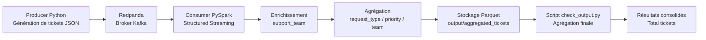

# Projet 9 - Exercice 2  
# Pipeline de tickets clients avec Redpanda et PySpark

---

## 1. Présentation

Ce projet met en place un pipeline de traitement de données en temps réel pour gérer des tickets clients.

L'objectif est de simuler un flux de tickets, les ingérer via un broker Kafka-compatible (Redpanda), les traiter en streaming avec PySpark, produire des agrégations analytiques, stocker les résultats en Parquet et recalculer une vue consolidée finale.

---

## 2. Schéma de flux de données (Mermaid)



---

## 3. Architecture du pipeline

Le pipeline repose sur plusieurs composants :

- Producer : génère des tickets simulés  
- Redpanda : transporte les messages  
- Consumer PySpark : traite les données en streaming  
- Parquet : stocke les résultats  
- check_output.py : consolide les résultats  

---

## 4. Technologies utilisées

- Python 3.11  
- PySpark 3.5.1  
- Redpanda (Kafka API)  
- Docker / Docker Compose  
- Parquet  
- Java  

---

## 5. Structure du projet

```
Samir_Belasri_P9_Exercice2/
├── consumer/
├── producer/
├── output/
├── check_output.py
├── docker-compose.yml
├── README.md
```

---

## 6. Fonctionnement détaillé

Le producer Python génère en continu des tickets clients au format JSON contenant les champs ticket_id, client_id, created_at, request, request_type et priority.

Exemple :

```json
{
  "ticket_id": 1,
  "client_id": 6661,
  "created_at": "2026-04-06T08:48:55.570739",
  "request": "Bug application mobile",
  "request_type": "commercial",
  "priority": "faible"
}
```

Ces tickets sont envoyés dans le topic Kafka `client_tickets` via Redpanda, qui agit comme broker Kafka-compatible et assure la transmission des messages.

Le consumer PySpark utilise Structured Streaming pour lire les données depuis Kafka avec les paramètres suivants :

```
kafka.bootstrap.servers = redpanda:9092
subscribe = client_tickets
startingOffsets = earliest
failOnDataLoss = false
```

Les messages sont convertis en JSON puis structurés via un schéma Spark.

Ensuite, une transformation métier est appliquée pour ajouter la colonne `support_team` :

- commercial → Equipe Commerciale  
- autres → Equipe Support Technique  

Une agrégation est ensuite réalisée avec :

```python
groupBy("request_type", "priority", "support_team").count()
```

Cette agrégation est faite par micro-batch et non globalement.

Les résultats sont stockés dans le dossier :

```
output/aggregated_tickets/
```

au format Parquet :

```
part-xxxxx.snappy.parquet
```

Des fichiers de checkpoint sont également créés pour le suivi du streaming.

Le script `check_output.py` relit ensuite tous les fichiers Parquet et effectue une agrégation globale finale :

```python
groupBy("request_type", "priority", "support_team").agg(sum("count"))
```

---

## 7. Lancement du projet

Démarrage complet :

```bash
docker compose up -d --build
```

Vérification :

```bash
docker ps
```

Logs producer :

```bash
docker logs -f ticket_producer
```

Logs consumer :

```bash
docker logs -f ticket_consumer
```

---

## 8. Vérification des fichiers

```bash
ls -R output/aggregated_tickets
```

Résultat attendu :

```
_SUCCESS
part-00000-xxxx.parquet
part-00001-xxxx.parquet
```

---

## 9. Arrêt propre

```bash
docker stop ticket_producer
sleep 5
docker stop ticket_consumer
```

---

## 10. Résultat final

```bash
python3 check_output.py
```

Exemple :

```
|commercial       |faible  |Equipe Commerciale      |2|
|commercial       |haute   |Equipe Commerciale      |7|
|support_technique|moyenne |Equipe Support Technique|8|
```

---

## 11. Points importants

- pipeline temps réel fonctionnel  
- Kafka (Redpanda)  
- Spark streaming  
- stockage Parquet  
- agrégation finale  

---

## 12. Limites

- agrégation finale hors streaming  
- micro-batch non consolidé en temps réel  
- pas de monitoring  

---

## 13. Améliorations possibles

- outputMode("complete")  
- base analytique  
- dashboard  
- monitoring  
- orchestration  

---

## 14. Conclusion

Ce projet met en place un pipeline temps réel complet avec ingestion Kafka, traitement Spark, enrichissement métier, agrégation et stockage analytique.

Le résultat est conforme aux attentes de l’exercice et démontre les bases d’un pipeline data moderne.

---

## 15. Auteur

Samir Belasri  
Projet 9 - Data Engineering